# Citizen Engagement Mobile Application

Ce repository contient le code source de l'application CityZen pour mobile.
Il s'agit d'une application invitant les citoyens à notifier les problèmes qu'ils rencontreraient dans leurs villes afin que ceux-ci soient corrigés par les personnes compétentes.
Nous allons voir dans ce README quelles sont les fonctionnalités de cette application.

1. [Login](#login)
2. [Menu principal](#main-menu)
 * [Afficher seulement](#view)
 * [Filter les types](#issue-types)
 * [Filtrer les statuts](#issue-states)
 * [Configuration](#settings-configuration)
3. [Paramètres](#settings)
 * [Écran d'accueil](#settings-homePage)
 * [Vue par défaut](#settings-homeView)
 * [Ma Position](#settings-myPosition)
 * [Distance problèmes](#settings-closeRange)
 * [Zoom par défaut](#settings-zoom)
 * [Filtres de statuts](#settings-stateFilters)
4. [Écrans principaux](#main-screens)
 * [Carte](#main-screen-map)
 * [Liste](#main-screen-list)
5. [Détails d'un problème](#issue-details-main)
 * [Détails](#issue-details)
 * [Carte](#issue-map)
6. [Ajouter un nouveau problèmes](#new-issue)

## 1. Login

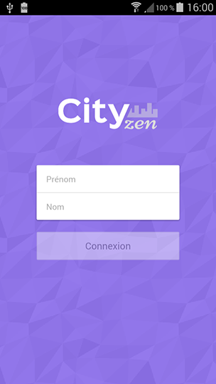

Lors du premier démarrage de l'application, l'utilisateur est convié à indiquer son prénom et son nom de famille afin d'être identifié dans l'application. Si c'est la première fois qu'il utilise l'application, un compte sera automatiquement créé avec les informations qu'il aura fourni. S'il a déjà utilisé l'application, son compte sera retrouvé.

<a href="#top">Retour en haut de la page</a>

## 2. Menu principal

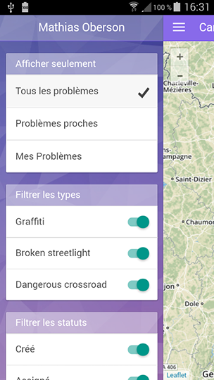

Le menu principal peut être affiché depuis les deux écrans principaux de l'application, grâce à une pression sur le bouton de menu  en haut à gauche.

Il se compose de plusieurs parties aux effets différents.

<a href="#top">Retour en haut de la page</a>

### Afficher seulement

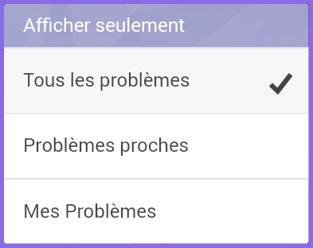

Cette liste indique quelles sont les trois manières d'afficher des problèmes dans l'application. Le choix de la vue à afficher lors de l'ouverture de l'application dépend des [préférences](#settings) de l'utilisateur.
* Tous les problèmes : Cette vue affiche tous les problèmes déjà enregistrés dans l'application. C'est la vue par défaut lors du premier démarrage de l'application.
* Problèmes proches : Cette vue n'affiche que les problèmes situés dans un certain rayon autour de la position actuelle de l'utilisateur. Ce rayon peut être définit dans les [préférences](#settings).
* Mes Problèmes : Cette vue n'affiche que les problèmes ajoutés par l'utilisateur actuel.

<a href="#top">Retour en haut de la page</a>

### Filtrer les types

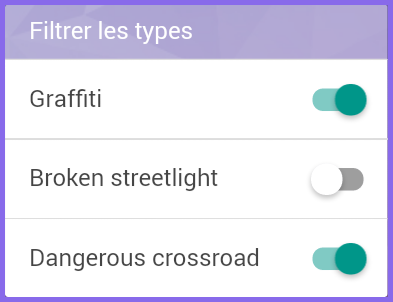

Cette liste permet d'activer ou désactiver l'affichage des problèmes selon leur type. Le nombre de ces derniers dépend du nombre de types de problèmes présent dans l'application au moment de l'ouverture de l'application. La capture d'écran présente ici est donc susceptiblee d'être différentes de celle réellement affichée dans l'application. Dans l'exemple affiché, les problèmes de type "Graffiti" et "Dangerous Crossroads" sont affichés tandis que les problèmes de type "Broken Streetlight" sont cachés.

<a href="#top">Retour en haut de la page</a>

### Filtrer les statuts

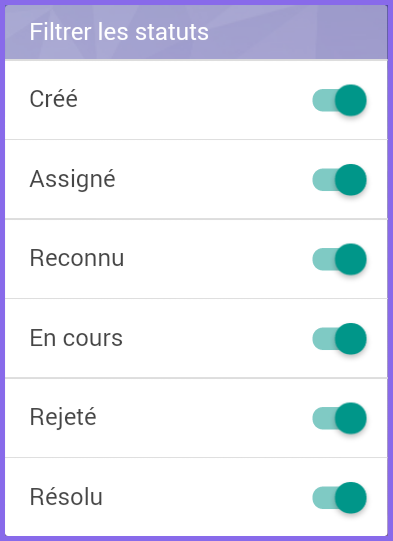

Cette liste permet d'activer ou de désactiver l'affichage des problèmes selon leur statut actuel. Il existe 6 statuts possible pour un problème :
* Créé : Le problème vient d'être créé par un utilisateur
* Assigné : Le problème a été assigné à un modérateur
* Reconnu : Le problème a été constaté par le modérateur auquel il a été assigné
* En cours : Des actions sont en cours pour résoudre le problème
* Rejeté : La résolution du problème a été rejetée par le modérateur
* Résolu : Le problème a été résolu

L'état de ces filtres au moment du démarrage de l'application dépend des [préférences](#settings) de l'utilisateur.

<a href="#top">Retour en haut de la page</a>

### Configuration

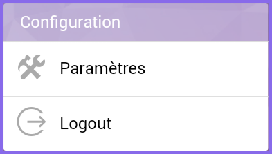

Cet encadré contient deux boutons :
* Préférences : Ce bouton permet d'afficher l'écran des préférences utilisateurs. La composition de cet écran est détaillé dans le chapitre suivant [3. Préférences](#settings).
* Logout : Ce bouton permet de déconnecter l'utilisateur actuel de l'application. Notez que cette action garde en mémoire les préférence définies dans l'application. Il ne peut pas y avoir de préférences par utilisateur, donc.

<a href="#top">Retour en haut de la page</a>

## 3. Préférences

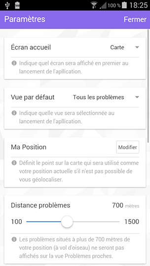

L'écran des préférences permet de modifier quelques comportements de l'application. La plupart de ces préférences prennent effet soit lors du prochain démarrage de l'application, soit, sous certaines conditions, immédiatement après la fermeture de l'écran des préférences. Passons en revue les différents paramètres.

### Écran d'accueil

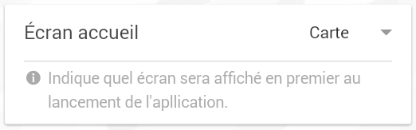

En modifiant ce paramètre, l'utilisateur modifie quel est l'écran principal affiché au démarrage de l'application. Il est possible de choisir entre "Carte" et "Liste". Pour plus d'informations sur ces écrans, référez-vous au chapitre suivant [4. Écrans principaux](#main-screens).

**Prend effet au prochain démarrage de l'application.**

### Vue par défaut

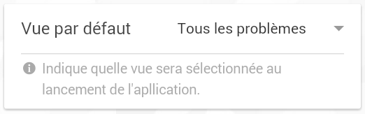

En modifiant ce paramètre, l'utilisateur modifie la vue sélectionnée par défaut au démarrage de l'application. Il est possible de choisir entre les trois vues "Tous les problèmes", "Problèmes proches" et "Mes Problèmes". Pour plus d'informations l'effet de ces vues, referez-vous au point ["Afficher seulement"](#view) du chapitre 2. Menu principal.

**Prend effet au prochain démarrage de l'application.**

### Ma Position

Ce paramètre représente la position par défaut de l'utilisateur dans les cas où sa localistion est requise mais qu'il a été impossible de le géolocaliser.
En cliquant sur le bouton "Modifier" , l'utilisateur fait apparaître une fenêtre comprenant une carte et un marqueur. Ce dernier représente la position par défaut actuellement enregistrée pour l'utilisateur.

Pour définir une nouvelle position par défaut, l'utilisateur peut soit déplacer le maruquer ou cliquer sur un endroit de la carte. Le bouton "Annuler"  permet de revenir à l'écran des préférences en annulant une éventuelle manipulation du marqueur. Le bouton "Valider"  permet quant à lui de valider cette nouvelle position.

Lors de la fermeture de cette fenêtre Ma Position, l'application tente de localiser l'utilisateur afin de savoir s'il elle doit utiliser cette nouvelle position immédiatement où si l'utilisateur peut être géolocaliser.

**Prend effet à la fermeture de la fenêtre des Préférences si la vue active est "Mes Problèmes" et que l'utilisateur n'a pas pu être géolocalisé.**

### Distance problèmes

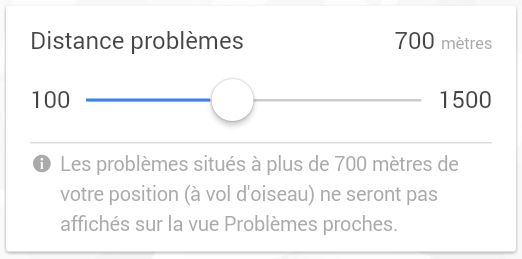

En modifiant ce paramètre, l'utilisateur modifie le rayon d'affichage des problèmes lors de la sélection de la vue "Problèmes proches". Ce rayon peut être au minimum de 100m et au maximum de 1500m. Les valeurs intermédiaires vont de 50m en 50m. Il est ainsi impossible d'avoir un rayon de 175m; les valeurs les plus proches seraient soit 150m, soit 200m.

En appuyant sur les bornes maximales, l'utilisateur peut directement choisir ces valeurs.

**Prend effet à la fermeture de la fenêtre des Préférences sur la vue active est "Mes Problèmes"**

### Zoom par défaut

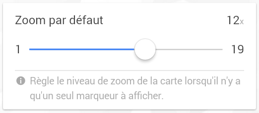

En modifiant ce paramètre, l'utilisateur modifie le niveau de zoom des cartes de l'application si ces dernières ne doivent afficher qu'un seul marqueur. C'est le cas pour la carte de Ma Position (cf. plus haut), l'affichage d'un problème unique sur la carte (cf. [5. Détails d'un problème > Carte](#issue-map)) ou lorsqu'une vue n'a aucun problème à afficher.

Ce zoom peut être au minimum de 1x et au maximum de 19x. En appuyant sur les bornes des extrêmités, l'utilisateur peut directement choisir ces valeurs.

**Prend effet au prochain démarrage de l'application**

### Filtres de statuts

Ce paramètre est constitué d'une liste indiquant tout les statuts possible pour un problème. L'état des différents filtres de cette liste sera reporté sur la liste des filtres de statuts du menu principal au démarrage de l'application. Pour plus d'informations sur la signification de ces filtres, referez-vous au point ["Filtrer les statuts](#issue-states).

**Prend effet au prochain démarrage de l'application**

<a href="#top">Retour en haut de la page</a>

## 4. Écrans principaux

Une fois connecté, l'utilisateur arrive sur un des deux écrans principaux de l'application, en fonction des [préférences](#settings) de l'application. Quelque soit l'écran sur lequel il arrive, en cliquant sur le bouton de menu  en haut à gauche, il peut faire apparaître le [menu principal](#main-menu).

### Carte

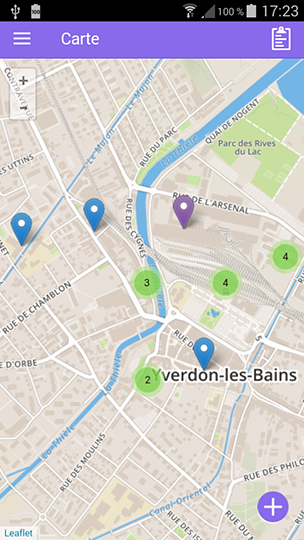

L'écran principal Carte affiche une carte du monde sur laquelle sont affichés les problèmes sélectionnés. En fonction des [préférences](#settings), il peut s'agit de tous les problèmes, des problèmes les plus proches de l'utilisateur ou bien seulement des problèmes ajoutés par l'utilisateur.

Lors de l'affichage de cet écran principal, la carte est affichée de telle manière que tous les marqueurs à afficher sont présents. Si plusieurs marqueurs sont très proches les uns des autres, ils sont regroupés au sein de groupes qui indiquent combien de marqueurs ils regroupent. Toucher un groupe zoom sur ce dernier et affiche les marqueurs qu'il contient ainsi que d'éventuels sous-groupes si besoin.

Toucher un marqueur a pour effet de centrer ce dernier sur la carte et d'afficher, en bas de l'écran un cadre contenant quelques informations sur le problème qu'il concerne. Ces informations sont :
* Le statut (l'icône à gauche du cadre)
* Un aperçu de la description (le texte noir en haut du cadre)
* L'utilisateur ayant ajouté ce problème (le texte violet en bas à gauche du cadre)
* Le nombre de commentaires et de tags (les chiffres et les icônes violettes en bas à droite)
Un geste rapide vers le haut ou un clique sur ce cadre ouvre la fenêtre des [détails du problème](#issue-details-main).

Le bouton "Nouveau"  permet d'afficher le formulaire d'[ajout de problème](#new-issue).

Le bouton "Liste"  permet de passer à l'écran principal Liste et d'y afficher les problèmes actuellement sélectionnés.

<a href="#top">Retour en haut de la page</a>

### Liste

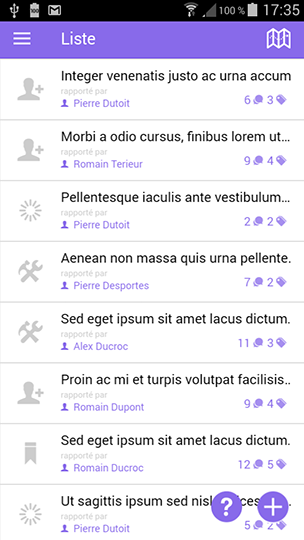

L'écran principal Liste affiche une liste qui affiche une partie des informations des problèmes sélectionnés. Ces informations sont les mêmes que celles affichées dans les cadre des marqueurs de l'écran carte, à savoir :
* Le statut (l'icône à gauche du cadre)
* Un aperçu de la description (le texte noir en haut du cadre)
* L'utilisateur ayant ajouté ce problème (le texte violet en bas à gauche du cadre)
* Le nombre de commentaires et de tags (les chiffres et les icônes violettes en bas à droite)
En fonction des [préférences](#settings), il peut s'agit de tous les problèmes, des problèmes les plus proches de l'utilisateur ou bien seulement des problèmes ajoutés par l'utilisateur.

Le bouton "Aide"  permet d'afficher une popup expliquant la légende des icônes de statuts.

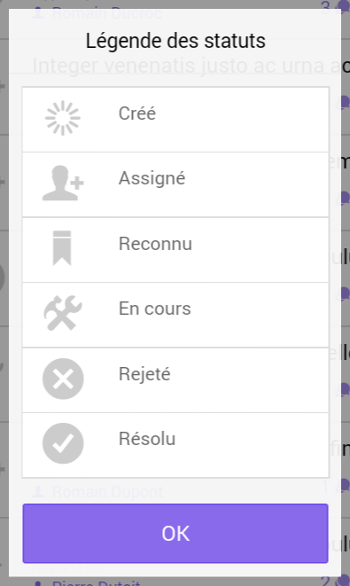

Le bouton "Nouveau"  permet d'afficher le formulaire d'[ajout de problème](#new-issue).

Le bouton "Carte"  permet de passer à l'écran principal Carte et d'y afficher les problèmes actuellement sélectionnés.

<a href="#top">Retour en haut de la page</a>

## 5. Détails d'un problème

Depuis les écrans principaux, en cliquant soit sur un marqueur (pour l'écran Carte) ou un élément de la liste (pour l'écran Liste), il est possible d'accéder aux détails d'un problème. Depuis cette vue de détails, il est possible de réafficher la carte du monde en n'indiquant que le problème actuellement consulté. Nous allons présenter tout d'abord l'écran des détails puis rapidement l'écran de la carte du problème.

### Détails

Cet écran permet de consulter les informations concernant un problème intéressantes pour l'utilisateur. Tout en haut de la page se trouve l'image représentant le problème.
Sont ensuite présents les différents tags que les utilisateurs ont ajoutés à ce problème. L'utilisateur actuel peut supprimer tout ou partie de ces tags en appuyant sur la petite croix à la droite du cadre.

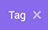

Il peut aussi ajouter un nouveau tag en appuyant sur le bouton "Nouveau Tag" .

Ceci aura pour effet de faire apparaître une popup lui permettant de saisir l'intitulé de ce nouveau tag. Notez que cet intitulé est limité à 20 caractères et que, lors de l'ajout du tag, tous les espaces vides compris dans cet intitulé seront supprimés.

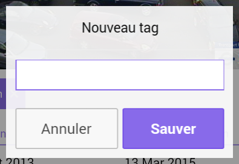

À la suite des tags se trouvent des métadonnées sur le problème, sa description, une barre d'état indiquant quel est l'état actuel du problème, puis les commentaires ajoutés par les utilisateurs s'il y en a, classés par ordre chronologique, le plus vieux commentaire en premier.

Tout en bas de la page se trouve une zone permettant à l'utilisateur de rajouter son propre commentaire. Notez que les commentaires sont limités à 140 caractères. Dès lors que l'utilisateur a commencé à taper son commentaire, le bouton d'envoi  devient actif.

<a href="#top">Retour en haut de la page</a>

### Carte

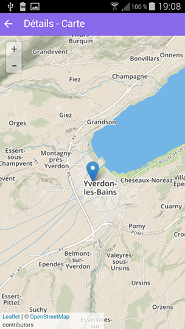

Ce écran peut être atteint depuis les détails d'un problème en appuyant sur le bouton "Détails - Carte" .

Sur cette carte est affichée un marqueur représentant le problème actuellement consulté. Il n'est possible que de nabiguer sur la carte et de zommer/dézoomer sur cette dernière. Un appui sur le bouton de retour permet de revenir aux détails.

<a href="#top">Retour en haut de la page</a>

## 5. Détails d'un problème

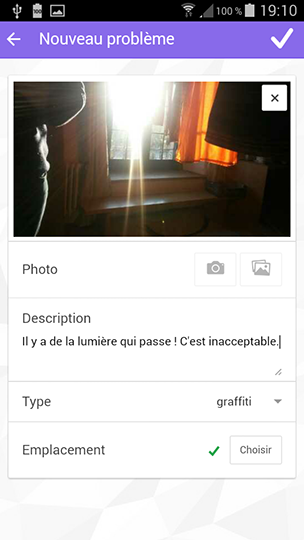

Cet écran peut être atteint en cliquant sur le bouton "Nouveau"  présent au bas des écrans "Carte" et "Liste".

Il permet de rajouter un nouveau problème dans l'application et présente, pour ce faire un formulaire à remplir. En tout premier se trouve l'image du problème. Dans l'exemple, l'image est déjà renseignée mais par défaut, une image de remplacement est présente. En appuyant sur le bouton d'appareil photo  il est possible de prendre une photo avec l'appareil photo du téléphone. En appuyant sur le bouton de la galerie 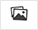 il est possible de choisir une photo parmi celles déjà présentes sur l'appareil photo. Une fois que la photo est sélectionnée, il est possible de la retirer du formulaire en cliquant sur la croix qui se situer en haut à droite de la photo.

Il est ensuite possible d'entrer une description pour ce problème. Cette description n'est pas limitée en termes de nombre de caractères.

Puis il faut choisir un type de problème parmi ceux disponibles dans la liste déroulante.

Enfin, la paramètre "Emplacement" permet d'indiquer où se situe le problème. Un appui sur le bouton "Choisir" 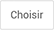, l'utilisateur fait apparaître une carte sur laquelle se trouve un marqueur représentant sa position actuelle. Il peut modifier l'emplacement de ce marqueur en le déplacant ou en appuyant à un endroit de la carte. Le bouton "Annuler"  permet de revenir à l'écran du formulaire en annulant une éventuelle manipulation du marqueur. Le bouton "Valider"  permet quant à lui de valider ce nouvel emplacement. Une fois l'emplacement sélectionné, une petite coche l'indique à côté du bouton "Choisir".

Lorsque le formulaire est correctement rempli, et seulement à ce moment-là, l'utilisateur peut appuyer sur le bouton "Enregistrer"  pour sauvegarder ce nouveau problème dans l'application. Il est alors renvoyer sur l'écran depuis lequel il a appuyer sur le bouton "Nouveau"  tandis que l'application recharge les données pour prendre en compte ce nouveau problème.
